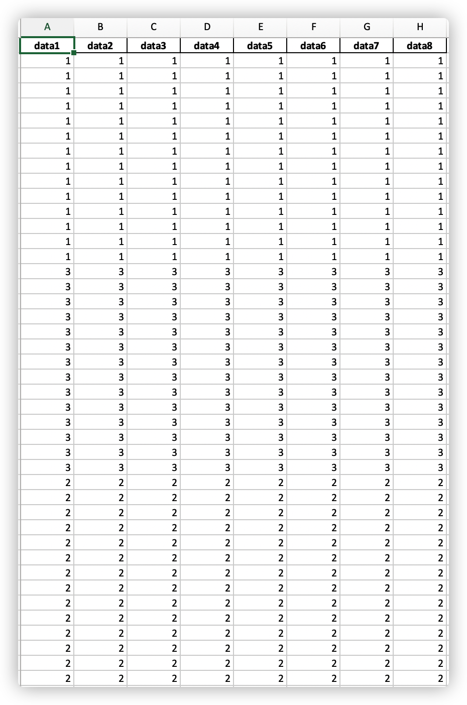
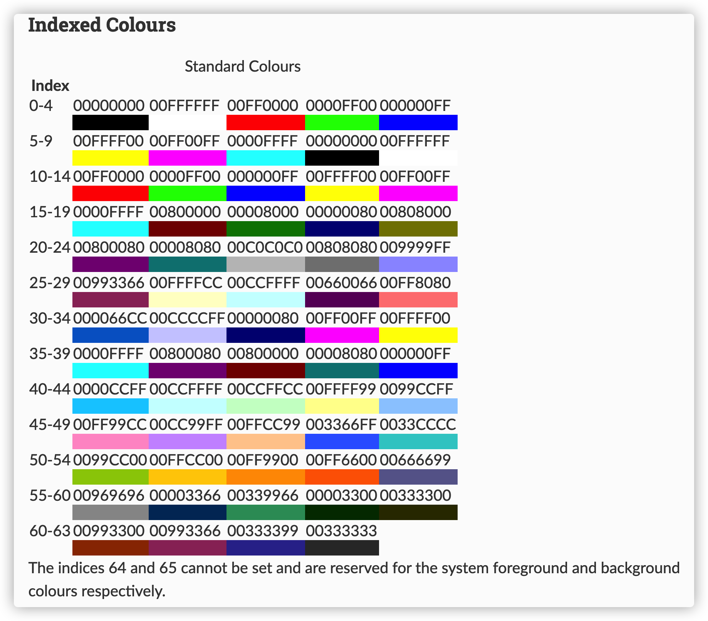

# 使用Python合并Excel工具

## 前言

很久没有发博了，乘今天休假，整理一个闲暇时间开发的Excel合并小工具。
GitHub地址：[这里](https://github.com/neoxie/merge-excel)

也许你的工作中也会经常需要处理Excel合并的问题，我大体上把这些问题分成两大类。

- 保留Excel头部，纯数据合并
- 保留Excel头部，但头部较复杂，例如含有合并单元格；每个excel需要合并的内容是由第一列的单元格跨越的行数决定的

以下针对上面的情况，分别给出解决方案

## 保留头部，纯数据的合并

举例说明：
输入是这样的：


输入希望是这样的：

引入超级pandas库，几行代码就能搞定，代码可以在[这里](https://github.com/neoxie/merge-excel/blob/master/task/merge.py)
核心代码如下：

```python
for file in filter_list:
    if not file.endswith(self.output_file):
        # 重构文件路径
        file_path = os.path.join(sub_dir, file)
        # 将excel转换成DataFrame
        print(f'merging {file_path} ...')
        dataframe = pd.read_excel(file_path)
        # 保存到新列表中
        new_list.append(dataframe)

# 多个DataFrame合并为一个
df = pd.concat(new_list)
# 写入到一个新excel表中
df.to_excel(merged_file, index=False)
```

## 保留复杂头部，文本和数据的混合合并

输入是这样的：


希望得到这样的输出：


这种情况，要借助强大的**openpyxl**库，唯一的缺陷是只支持xlsx格式的文件，要使用这个工具，用户需要先要把xls格式文件通过excel转换为xlsx格式了。
openpyxl有非常完善的文档说明：[here](https://openpyxl.readthedocs.io/en/stable/index.html)

为了保障合并的灵活性，我用**文件名**来指定合并规则：

- <目标SHEET><处理顺序号>-<源SHEET><源文件区块>.xlsx
- 目标SHEET和源SHEET，用英文字母表示，第一个SHEET是A，依此类推，最大支持26个SHEET，从（A到Z）
- 处理顺序号，用数字表示，指定文件被处理的顺序，例如A0，代表拷贝到第一个SHEET的第一个需要处理的文件
- 源文件区块，用数字表示。区块的划分，是通过文件第一列所占用的行数来决定的。例如有的excel头部，是一个跨越多行的合并单元格，如下图，则该文件的第一个区块就是1-3行，第二个区块从第四行算起，然后看第一列跨越了多少行来决定第二个区块的行数
- 当文件名的“-”两边一致的情况下，可以省略，例如：A0-A0.xlsx，可以缩写为A0.xlsx
- 最大支持10000个区块

举例说明：

1. 拷贝源文件第一个SHEET的头部到目标文件的第一个SHEET中
A0-A0.xlsx  
2. 拷贝源文件第二个SHEET的第二个区块的内容到第一个SHEET中
A1-B1.xlsx

代码入口文件在[这里](https://github.com/neoxie/merge-excel/blob/master/task/combine.py)

## 执行

### 安装Python和依赖包

- 安装最新版本的[Python](http://www.python.org)
- 安装依赖包:

```cmd
@REM 请cd到当前目录，例如: cd merge-excel-master

pip install -r requirements.txt
```

### 准备excel文件

- 在当前目录新文件夹("**to_combine**"), 如果存在不需要重复创建
- 把需要合并的excel文件拷贝到“to_combine”文件夹下
- 请参考前面章节的excel文件命名规则

### 配置文件

配置文件是config.json,
header_color: 配置头部背景色
block_colors: 配置区块的背景色，会自动根据配置的背景色个数，循环使用
column_types: 配置特殊列格式，Excel文件有时候会丢失单元格格式信息，例如时间类型，Excel源文件中会是一个数字，但其实是一个时间，下面的例子，就是以第9列是时间类型格式的特殊处理

```json
{
  "header_color": "C0C0C0",
  "block_colors": ["99CCFF", "FFFFFF"],
  "column_types": [
    {
      "column_number": 9,
      "source_data_type": "n",
      "source_value_type": "int",
      "target_data_type": "d",
      "target_number_format": "%Y.%m"
    }
  ]
}
```

颜色代码：可参考[这里](https://openpyxl.readthedocs.io/en/stable/styles.html)


### 运行

excel文件准备好后，在windows上双击: "**run.cmd**"
在mac上，打开terminal, 执行:

```sh
python index.py
```


如果执行成功，会在最后一行显示“done”，同时在当前目录生成"combined.xlsx"文件

如果执行失败，在窗口中会有错误提示！
